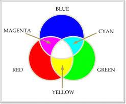
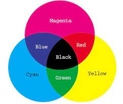
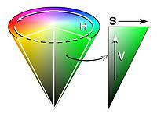

Image 색상 표현 방법(컬러 모델)
===============================================================================

## 1. RGB 모델

* 가장 기본적인 색상 모델
* 색을 광원인 Red, Green, Blue의 3가지 성분을 조합으로 보는 것

    * R: Red( 빨간색 )
    * G: Green( 초록색 )
    * B: Blue( 파란색 )

* 각 색마다 8bit으로 표현되어 (2^8)^3 = 16,777,216가지 색으로 표현된다.

* 색을 혼합할수록 색이 밝아지는 가산 체계(Additive System)을 사용한다.

    * 검은색의 경우 R = G = B = 0
    * 흰색의 경우 R = G = B = 1

* 빛의 성질과 같기 때문에 빛을 방사하는 디스플레이 장치에 적합한 방식이다.

    * 모니터나 TV 등에 기본으로 적용되고 있다.

Figure 1. RGB Model 가산 혼합

Figure 2. RGB Model 모형

 

## 2. CMY 모델
* 빛의 반사에 의해 발생하는 2차 색상에 대한 모델

* Cyan, Magenta, Yellow가 삼원색이다.

    * C: Cyan( 청록색 )
    * M: Magenta( 자홍색 )
    * Y: Yellow( 노랑색 )

* RGB와는 달리 색이 섞이면 섞을수록 어두워진다.

* 물감이나 잉크를 이용하는 장치에서 사용된다.
    * 예시로는 프린터가 있다.

Figure 3. CMY Model

Figure 4. CMY Model 모형

 

## 3. HSV 모델
* 인간이 인식하는 색상과 흡사한 모델을 만들기 위해 고안되었다.

* Hue, Saturation, Value로 구성된다.
    * H(Hue): 색상
    * S(Saturation): 채도
    * V(Value): 명도
* H, S, V 각각의 0에서 255 사이의 값으로 표현된다.

* H의 경우
    * 색의 종류를 나타내기 때문에 크기는 의미가 없다.
    * 단순한 index를 나타낸다.

* S의 경우
    * 0에 가까울 수록 무채색(회색)이다.
    * 255에 가까울수록 선명한(순수한) 색이다.
        * 백색광에 의해 탁한 정도를 나타낸다.

* V의 경우
    * 작을 수록 어둡고, 클수록 밝은 색이다.

* 채도란
    * 색의 순수도 또는 순수한 색이 흰 빛에 의해 희석된 척도

* 명도란
    * 색의 밝기를 나타낸다.
    * 작을수록 어둡고 클수록 밝다.

* RGB 각 채널이 0에서 1 사이의 실수 값을 가지는 색을 HSV로 변환하면 S와 V의 범위는 0과 1사이가 된다.

Figure 5. HSV 모델

* H의 경우 각도가
    * 0이면 빨간색이다.
    * 60이면 노란색이다.
    * 120이면 초록색이다.
    * 180이면 하늘색이다.
    * 240이면 파란색이다.
    * 300이면 자홍색이다.
