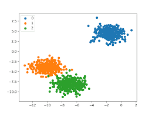
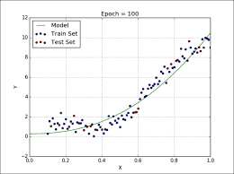
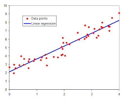

Classification Vs Regression
===============================

## 1. Classification
* 주어진 데이터를 클래스 별로 구별해 내는 과정
* 다양한 분류 알고리즘을 통해 데이터와 데이터의 레이블 값을 학습시키고 모델을 생성
* 데이터가 주어졌을 때 학습된 모델을 통해 어느 범주에 속한 데이터인지 판단하고 예측한다.
* 예측하고 싶은 결과가 이름 혹은 문자일 경우 사용한다.
* 예시로는
    * 공부시간을 가지고 합격 여부를 확인
        * 합격 / 불합격
    * X-ray 사진과 영상 속 종양의 크기 및 두께를 가지고 악성 종양 여부 확인
        * 양성 / 음성
    * 키, 몸무게, 시력, 지병 등을 토대로 현역, 공익,면제 여부를 확인한다.
        * 현역 / 공익 / 면제
    * 이제까지 받은 메일을 모으고, 이들을 스팸 메일과 일반 메일로 구분
        * 스팸 / 일반
    * 소고기의 정보를 토대로 등급을 측정
        * 소고기 등급

Figure 1. Classification 예시

Figure 2. Classification 예시

## 2. Regression
* 여러개의 독립변수와 한 개의 종속변수 간의 상관관계를 모델링하는 기법

* 예측하고 싶은 종속변수가 숫자일 때 사용한다.

* 종속 변수(목표)와 하나 이상의 독립 변수(예측 변수라고도 함) 간의 미래 사건을 예측하는 방법
    * 지금까지의 데이터를 추합하여 미래에는 어떻게 될지 예측하는 방법

* 예시로는
    * 학습 시킬 데이터 생성
        * 종속 변수
     
     
    * 사람들의 공부시간과 점수를 입력받고 점수를 예측한다.
        * 시험 점수
     
     
    * 온도와 그날의 판매량을 기록하여 미래의 판매량 등을 예측할 수 있다.
        * 레모네이드 판매량
     
     
    * 집과 역까지의 거리, 수치화된 조망의 평점 등을 집 값과 함께 기록하여 집값을 예측할 수 있다.
        * 집 값

Figure 3. Regression 그래프화

Figure 4. Regression 그래프화

