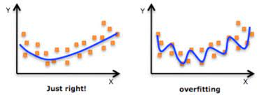
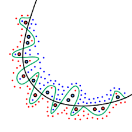

Overfitting
===============================================================================

## 1. Overfitting
* 학습 데이터(Training Set)에 대해 과하게 학습된 상황

    * 학습 데이터 이외의 데이터에 대해선 모델이 제대로 작동하지를 못한다.

* Training Set에 대한 loss는 계속 떨어지는데, Test Set에 대한 loss는 감소하다가 다시 증가한다.

* 예를 들면

    * 노란색 고양이를 보며 고양이의 특성을 학습한 사람이 검은색이나 흰색 고양이를 보고는 그것을 고양이라고 인식하지 못 하는 현상

Figure 1. 정상적인 경우와 Overfitting의 차이

Figure 2. Overfitting 예시

#### 1-1. Overfitting이 발생하는 이유
* 훈련 데이터 크기가 너무 작고 가능한 모든 입력 데이터 값을 정확하게 나타내기에 충분한 데이터 샘플을 포함하지 않은 경우

* 노이즈 데이터라고 하는 관련 없는 정보가 많이 포함되어 있는 경우

* 모델이 단일 샘플 데이터 세트에서 너무 오래 훈련하는 경우

* 모델 복잡도가 높기 때문에 훈련 데이터 내의 노이즈를 학습하는 경우

#### 1-2. Overfitting을 감지하는 방법
1. Train set과 test set에 대한 Model의 성능을 비교하여 test set에 대한 성능이 train set보다 낮을 경우 overfitting이 나올 수 있다.

2. K-Fold 교차 검증
    * Train set을 K개의 부분 set 혹은 Fold라고 하는 샘플 세트로 나눈다.
    * 하나의 하위 세트를 검증 데이터로 유지하고 나머지 K-1 하위 세트에 대해 기계 학습 모델을 훈련시킨다.
    * 검증 샘플에서 모델이 어떻게 작동하는지 관찰
    * 출력 데이터 품질을 기준으로 모델 성능을 평가한다.

#### 1-3. Overfitting을 방지하는 방법
1. 조기 중지
    * 기계 학습 모델이 데이터의 노이즈를 학습하기 전에 학습 단계를 일시 중지
    * 타이밍을 맞추지 못하면 모델은 정확한 결과를 제공하지 못한다.

2. 프루닝
    * 프루닝은 훈련 세트 내에서 가장 중요한 기능을 식별하고 관계없는 기능을 제거한다.
    * 예를 들면
        * 이미지가 동물인지 사람인지 예측하기 위해 얼굴 모양, 귀 위치, 신체 구조 등의 다양한 입력 파라미터를 볼 수 있는데
        * 여기에서 얼굴 모양을 우선시하고 눈 모양은 무시할 수 있다.

3. 정규화
    * 정규화는 과대적합을 줄이기 위한 훈련/최적화 기술의 모음
    * 중요도에 따라 기능을 등급화하여 예측 결과에 영향을 미치지 않는 요소를 제거한다.

4. 앙상블링
    * 앙상블링은 여러 개별 기계 학습 알고리즘의 예측을 결합
    * 여러 모델을 사용하여 샘플 데이터를 분석하고 가장 정확한 결과를 선택한다.
    * 배깅, 부스팅 등이 주요 앙상블 기법이다.
    * 부스팅은 서로 다른 기계 학습 모델을 차례로 훈련하여 최종 결과를 얻는다.
    * 배깅은 병렬로 훈련시킨다.

5. 데이터 증강
    * 데이터 증강은 모델이 처리할 때마다 샘플 데이터를 약간씩 변경하는 기계 학습 기술
    * 적당히 수행되면 데이터 증강은 학습 세트를 모델에 고유하게 표시하여 모델이 특성을 학습하지 못하게 한다.
    * 예를 들면
        * 변환, 뒤집기, 회전과 같은 변환을 입력 이미지에 적용한다.

