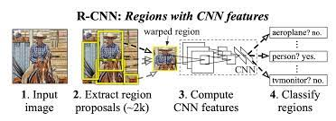
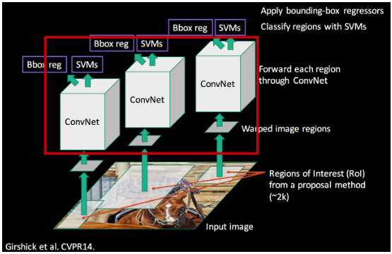
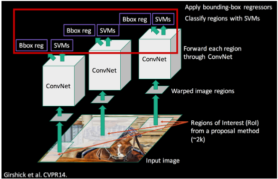

RCNN 논문 리뷰 및 정리
=================================

## 1. RCNN

* 'Regions with Convolutional Neural Networks features'의 약자

* 설정한 Region을 CNN의 feature(입력값)로 활용하여 Object Detection을 수행하는 신경망
* 2014년에 CNN을 Object Detection 분야에 최초로 적용시킨 모델

* CNN을 이용한 검출 방식이 Classification 뿐만 아닌 Object Detection 분야에도 높은 수준의 성능을 이끌어 낼 수 있다는 것을 보여준 의미 있는 모델

#### 1-1. RCNN 과정

Figure 1. RCNN 과정

1. image를 입력 받는다.

2. Selective search 알고리즘에 의해 regional proposal output 약 2000개를 추출한다.

3. 추출한 regional proposal output을 모두 동일 input size로 만들어주기 위해 warp 해준다.

    * warp: CNN에 입력하기 전에 일정한 크기로 리사이즈하거나 특정한 형태로 변형시키는 과정

    * warp를 해주는 이유

        * 마지막 FC layer에서의 input size는 고정이므로 Convolution Layer에 대한 output size도 동일해야 하기 때문에 사이즈를 통일해야 한다.

        * Convolution Layer에 입력에서부터 동일한 input size로 넣어주어서 output size를 동일하게 하는 것

4. 2000개의 warped image를 각각 CNN 모델에 넣는다.

5. 각각의 Convolution 결과에 대해 classification을 진행하여 결과를 얻는다

#### 1-2. RCNN 구조
* 2-stage Detector

* 전체 task를 두 단계로 나눌 수 있다.

    * 물체의 위치를 찾는 Region Proposal

    * 물체를 분류하는 Region Classification

1. Region Proposal

Figure 2. RCNN 구조 - Region Proposal

* "Object가 있을법한 영역"을 찾는 모듈

* 기존의 Sliding window 방식의 비효율성을 극복하기 위한 것

1-1. Sliding window란?

* 이미지에서 물체를 찾기 위해 window의 (크기, 비율)을 임의로 마구 바꿔가면서 모든 영역에 대해서 탐색하는 것

* 단점으로는 임의의 (크기, 비율)로 모든 영역을 탐색하는 것은 너무 느리다.

Figure 3. Sliding Window 방식 - 좌 : 모든 영역에 대해 탐색 / 우 : 크기와 비율을 변형

* R-CNN에서는 이 비효율성을 극복하기 위해 Selective Search 알고리즘을 사용

1-2. Selective Search 알고리즘 과정

Figure 4. Selective Search

* 색상, 질감, 영역크기 등.. 을 이용해 non-object-based segmentation을 수행 
    * Bounding box들을 Random하게 작게 많이 생성
 
 

* Bottom-up 방식으로 small segmented areas들을 합쳐서 더 큰 segmented areas들을 생성
    * 이웃한 영역들의 유사도를 측정하여 유사한 영역을 그룹화하고, 이어서 큰 영역을 형성
 
     

* (2) 작업을 반복하여 최종적으로 2000개의 region proposal을 생성
    * ROI(Regions of Interest)라는 영역을 제안하는 Region Proposal 형식으로 진행
 
 

2. CNN

Figure 5. RCNN 구조 - CNN

* Warp작업을 통해 region proposal 모두 224x224 크기로 되면 CNN 모델에 넣는다

    * AlexNet의 거의 구조를 그대로 가져다 썼다

* CNN을 거쳐 각각의 region proposal로부터 4096-dimentional feature vector를 뽑아내고 이를 통해 고정길이의 Feature Vector를 생성한다.

3. SVM (Support Vector Machine)

Figure 6. RCNN 구조 - SVM

* CNN 모델로부터 Feature가 추출이 되고 Training Label이 적용되고 나면 Linear SVM을 이용하여 classification을 진행

