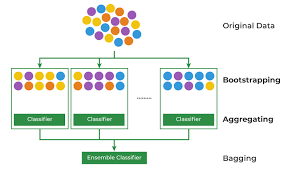
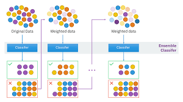
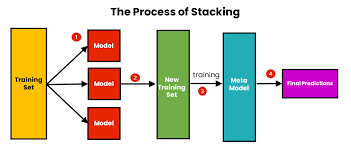

Ensemble
========

## 1. ensemble이란?
* 여러개의 모델을 조합해서 그 결과를 뽑아 내는 방법

## 2. ensemble 방법의 종류
### 1.  Bagging(배깅)

Figure 1. Bagging

* 샘플을 여러번 뽑아 각 모델을 학습시켜 결과물을 집계(Aggregation)하는 방법
* 카테고리 데이터는 투표 방식(Votinig)으로 결과를 집계하며, 연속형 데이터는 평균으로 집계
* 대표적으로 Random Forest가 Bagging 방식을 사용한다.

### 2. 부스팅(Boosting)

Figure 2. Boosting
* 이전 모델의 오답에 가중치를 높게 부여하여 다음 모델을 학습하는 방법
* 오답을 정답으로 맞추기 위해 오답에 더 집중하여 학습시키기 떄문에 일반적으로 배깅에 비해 정확도가 높다
* 틀렸던 부분에 대해 반복적으로 학습하므로 오버피팅의 문제가 있으며, outlier에 취약하고, 속도가 느리다

### 3. 스태킹(Stacking)

Figure 3. Stacking
* 여러 개별 모델이 예측한 결과값을 다시 학습 데이터셋으로 사용해서 모델을 만드는 방법
* Overfitting의 위험이 있으므로 Cross Validation 방법을 사용한다.
* 많은 개별 모델의 결과를 결합하여 예측 성능을 높일 수 있다는 장점